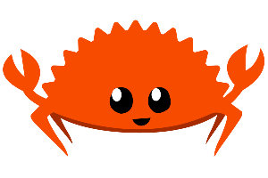

# Journey into the land of the Rustaceans

This repo will contain my notes and programs as I learn Rust.

## Goals
1. Become comfortable using Rust for low-level programming
2. Rewrite a GNU util in Rust
3. Write a HTTP server in Rust

## The Rust Programming Language

I'm using the book hosted at [doc.rust-lang.org/book](https://doc.rust-lang.org/book/title-page.html)

Topics covered so far:
- [Hello World](https://github.com/shinroo/rust-learning/tree/main/rust-book/hello-world)
- [Hello Cargo](https://github.com/shinroo/rust-learning/tree/main/rust-book/hello-cargo)
- [Guessing Game](https://github.com/shinroo/rust-learning/tree/main/rust-book/guessing-game)
- [Variables and Mutability](https://github.com/shinroo/rust-learning/rust-book/tree/main/variables-mutability)
- [Data Types](https://github.com/shinroo/rust-learning/rust-book/tree/main/data-types)
